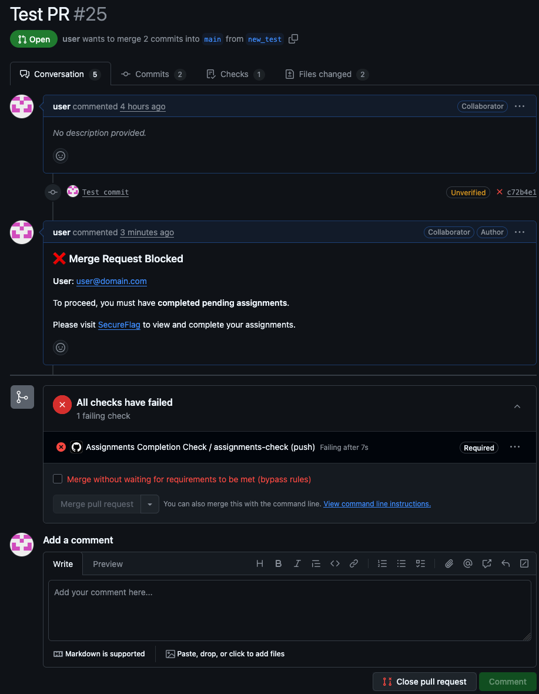

# SecureFlag Assignments Check GitHub Action

This GitHub Action helps enforce secure development practices by verifying that contributors have completed their required SecureFlag assignments before allowing code to be merged.

When a Pull Request (PR) is submitted or updated, the action:
- Gets the committer's email from the PR.
- Queries SecureFlag's database to verify if the author has completed the required assignments based on the specified check type.
- If the author hasn't completed the required assignments, the action creates a PR comment with information and blocks the PR.

When the assignments are completed, the action can be re-run to unblock the PR.

## Assignment Check Types

The action supports three types of assignment checks:

- **`completed_initial`**: Verifies that the user has completed all initial assigned training.
- **`completed_pending`**: Verifies that the user has completed all pending assignments (default).
- **`not_expired`**: Verifies that the user has no expired assignments.

## How to Use
### Add the following snippet to your workflow file
(e.g., `.github/workflows/assignments-check.yml`)

```yaml
name: Assignments Completion Check

on:
  push:
    branches:
      - '*'
      - '!main'

jobs:
  assignments-check:
    runs-on: ubuntu-latest
    steps:
      - uses: secureflag/actions/.github/actions/assignments_check_with_label@main
        with:
          target_repo: ${{ github.repository }}
          gh_token: ${{ secrets.SEC_TOKEN }}
          api_endpoint: ${{ secrets.API_ENDPOINT }}
          api_token: ${{ secrets.API_TOKEN }}
          assignment_check_type: 'completed_pending'
```

#### Required Variables
The job uses the following inputs:

- `target_repo`: The full name of the repository (e.g., org/repo). `${{ github.repository }}` sets the current org/repo
- `gh_token`: (Required) GitHub token with permission to:
  - Read the Pull Request's description
  - Read the commits messages
  - Create a comment in a Pull Request
  - Classic Personal Access Token with "public_repo and "read:org" permission should suffice
- `api_endpoint`: (Optional) SecureFlag API endpoint URL. Defaults to `https://api.secureflag.com/rest/management/v2/users/hasCompletedTraining`
- `api_token`: (Required) API token to authenticate with SecureFlag.
- `assignment_check_type`: (Optional) Type of assignment check to perform: `completed_initial`, `completed_pending`, or `not_expired`. Defaults to `completed_pending`.

Store all sensitive values as GitHub Secrets in your repository or organization.

### Set Branch Protection rule to enforce blocking of the Pull Request
- Repository Settings
- Branches
- Add Branch protection rule
  - Set branch name pattern (eg. "main")
  - Select "Require status checks to pass before merging".
  - Select "Require branches to be up to date before merging"
  - Below that, set "assignments-check" as Status Check
- Save

#### Example of blocked PR
When assignments are incomplete, the PR will be blocked with a comment indicating what requirements need to be met and a link to SecureFlag to complete the assignments.

